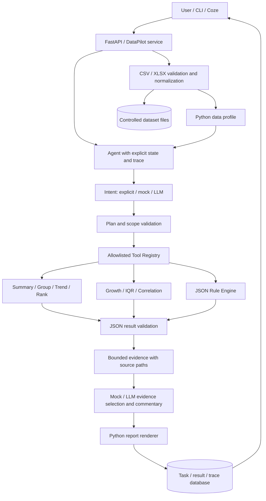

# DataPilot

[](https://github.com/FORWARD1121/datapilot-agent/actions/workflows/tests.yml)

**An evidence-grounded data analysis agent for small and medium tabular datasets.**
Upload a CSV or Excel worksheet, ask a business question, and receive computed
metrics, rule findings, a structured report and an inspectable execution trace.
The demo uses fictional sales data; the tool layer also accepts other numeric
metrics and categorical dimensions.

**Python calculates. Configured rules evaluate business conditions. The workflow
controls tool execution. An optional LLM interprets requests and selects evidence.**
The model never executes generated Python or SQL and never receives the original
spreadsheet as a substitute for computation.

This is a runnable portfolio project, not a production multi-tenant analytics
platform. It runs without a paid API key. Coze integration assets are provided;
a cloud bot/workflow has **not** been deployed or verified by this repository.

## Core functionality

- Bounded CSV/XLSX ingestion, audited normalization, schema inference and profiling.
- Eight independently testable analysis tools, including calendar-aligned growth,
  weighted profit margin, ranking, IQR anomalies and configurable business rules.
- Validated intent, a bounded tool plan, tool execution, result validation,
  evidence selection and deterministic report rendering with provider provenance.
- OpenAI-compatible HTTP provider with structured JSON validation, function-tool
  calling, one repair attempt per stage and disclosed deterministic fallback.
- FastAPI, SQLAlchemy/SQLite persistence, offline demo, authenticated Coze facade,
  OpenAPI descriptions and adversarial regression tests.

## Architecture



The intent defines the allowed metrics, dimensions and scope. The planner cannot
change them, call an unknown tool or omit the requested analysis. Plans contain
at most eight calls. This is a bounded single-agent workflow, not an open-ended
multi-agent framework. See [architecture](docs/architecture.md).

## Tech stack

Python 3.11+, FastAPI, Pandas, NumPy, Pydantic, SQLAlchemy, SQLite, HTTPX,
Openpyxl, Pytest and Ruff. Optional: an OpenAI-compatible model endpoint and
Coze HTTP/plugin nodes. No RAG, vector database, Redis, Kafka or generated-code
execution is needed for this implementation.

## Quick start

Use Python 3.11, 3.12 or 3.13. From a checkout:

```bash
git clone https://github.com/FORWARD1121/datapilot-agent.git
cd datapilot-agent
python -m venv .venv
source .venv/bin/activate
python -m pip install -r requirements.txt
python -m pip install -e ".[dev]"
python scripts/demo.py
```

On Windows PowerShell, activate with `.venv\Scripts\Activate.ps1` instead.
The default demo forces the mock provider and uses a temporary local database,
without touching a database configured through environment variables.

Start the API in another terminal using the same environment:

```bash
python -m uvicorn app.main:create_app --factory --host 127.0.0.1 --port 8000
```

Open `http://127.0.0.1:8000/docs` for interactive API documentation.
Do not expose the default unauthenticated local mode to a public network.

## Demo

```bash
# Full offline analysis; no server or API key required.
python scripts/demo.py

# Retain the demo workspace and full JSON output.
python scripts/demo.py --data-dir .datapilot/demo --output .datapilot/demo/report.json

# Against an already running local API: health, upload, profile, trend, rank,
# anomalies, task retrieval and report equality.
python scripts/smoke_http.py
```

The sample contains 107 fictional rows, including one intentional duplicate,
multiple regions/products and planted changes/outliers. These are illustrative
fixtures, not evidence of model accuracy or business impact. The default cleaning
policy retains duplicates and reports them. See [sample design](data/samples/README.md).

## Configuration

Copy `.env.example` to `.env`, or supply environment variables. Never commit keys.

| Setting | Default / meaning |
|---|---|
| `APP_ENV` | `local`; `public` requires an API token of at least 32 characters |
| `DATA_DIR` | `.datapilot`; local normalized datasets and default SQLite database |
| `DATABASE_URL` | Unset; uses SQLite under `DATA_DIR` |
| `API_TOKEN` | Empty locally; nonempty values protect all dataset/analysis endpoints |
| `LLM_PROVIDER` | `mock` or `openai_compatible` |
| `LLM_API_KEY`, `LLM_MODEL` | Needed for actual model calls |
| `LLM_BASE_URL` | `https://api.openai.com/v1`; operator-controlled, not request-controlled |
| `LLM_TIMEOUT_SECONDS` | 20 per HTTP request |
| `MAX_UPLOAD_BYTES` | 10485760 (10 MiB) |
| `MAX_ROWS`, `MAX_COLUMNS`, `MAX_CELLS` | 50000, 100, 1000000 |
| `RULES_PATH` | Optional JSON rule file; otherwise packaged sample rules |

For a real endpoint, set `LLM_PROVIDER=openai_compatible`, `LLM_API_KEY`,
`LLM_BASE_URL` and `LLM_MODEL`. The endpoint must support Chat Completions,
`tools`, required tool choice and `response_format: json_object`. Validation is
performed locally with Pydantic; this is not a claim of provider-native strict
JSON-schema support. Run `python scripts/demo.py --live` to use that configuration.

Every report discloses `configured_provider`, `intent_source`, `plan_source`,
`insight_source` and fallback reasons. HTTP 201 does not prove a live model was
used: a failed model stage may have recovered through the mock provider. Real
paid-endpoint behavior remains unverified without your credentials.

SQLite is the tested default. SQLAlchemy permits configuring another database;
`pip install -e ".[mysql]"` installs the optional MySQL driver. MySQL deployment,
schema migrations and cross-database behavior are not verified in this release.

## API

| Method | Path | Purpose |
|---|---|---|
| GET | `/health` | Database health and configured mode/provider |
| POST | `/datasets/upload` | Multipart `file`; optional `drop_duplicates` form field |
| GET | `/datasets/{dataset_id}/profile` | Data quality, schema and descriptive statistics |
| POST | `/analysis` | Synchronous analysis from `dataset_id`, `query`, optional `intent` |
| GET | `/analysis/{analysis_id}` | Status, plan, tool results, trace and report |
| GET | `/analysis/{analysis_id}/report` | Completed structured report |
| POST | `/integrations/coze/analyze` | Flat facade: ID, status, summary and encoded report |

```bash
curl http://127.0.0.1:8000/health
curl -F "file=@data/samples/sample_sales.csv" http://127.0.0.1:8000/datasets/upload

# Replace DATASET_UUID with the upload response's dataset_id.
curl -X POST http://127.0.0.1:8000/analysis \
  -H "Content-Type: application/json" \
  -d '{"dataset_id":"DATASET_UUID","query":"compare sales by region"}'
```

With authentication enabled, also pass `-H "X-API-Key: $API_TOKEN"`. Successful
uploads/analyses return 201. Validation errors use 422; failures share an
`error` object with a safe code, message and request ID. Failed analyses can
include an `analysis_id` for inspection. See [explicit intents and API examples](docs/api.md).

## Analytics semantics

`aggregation` supports `sum`, `mean` (AVG), `count` (nonmissing values), `min` and
`max`. Data quality reports separately expose row counts. `profit_margin` is
`sum(profit) / sum(sales_amount)`, not the mean of row margins. Missing ratio
inputs or nonpositive sales produce a null with a reason. Integer sums avoid
int64 wraparound; unrepresentable floating-point results are not fabricated.

Growth compares the previous calendar day/month, or the same month a year
before. Only history inside the selected scope is used. Missing periods are not
zero-filled; zero or negative comparison baselines return explicit reasons.
`last_n_months` is anchored to the latest observed date after categorical filters,
not the server clock. Edge periods can be partial; there is no forecasting.

Ranking uses competition ranks with a stable dimension order and an exact Top-K
cutoff; `ascending: true` selects Bottom-K. Contribution is available for additive
nonnegative group sums with a positive total. IQR is row-level within groups,
requires at least four nonmissing values and reports truncation. Pearson
correlation requires sufficient nonconstant paired observations and is not a
causal conclusion.

Ingestion trims whitespace, removes entirely empty rows, reports missing values
and optionally removes duplicate rows. It does not impute data. Numeric dates
such as `20260101` in date-named columns are parsed explicitly; unlabeled Excel
serials/epochs are not guessed. Timestamps normalize to UTC-naive values.
Only one worksheet per XLSX is accepted; formulas must be exported as values.

The offline parser supports a small documented English/Chinese keyword and
alias set. It is not general natural-language understanding. Use an explicit
`intent` for precise filters, time windows, aggregation or nonstandard columns.
Inspect the returned plan rather than assuming every phrase was understood.

## Reports and evidence

Numeric findings are rendered from Python tool results, with evidence IDs and
JSON paths into persisted outputs. Models may choose evidence and propose
commentary, but cannot supply their own numeric fact fields. Unknown citations
and digit-bearing commentary are rejected. Hypotheses remain explicitly
unverified: these controls do not prove semantic correctness or eliminate all
prompt injection/hallucination risks.

Evidence sent to the model is bounded separately from stored tool results.
Within retained tool records, selection prioritizes growth extremes, anomaly
deviations and triggered rule severity. Full records and truncation warnings
remain inspectable. Financial values use ordinary numeric analytics, not
accounting-grade decimal arithmetic or audited financial advice.

## Coze integration

[The Coze guide](docs/coze/README.md) includes node wiring, variables, headers,
JSON request bodies, status/error branches, timeout/retry choices and manual
acceptance steps. A [minimal OpenAPI schema](docs/coze/openapi.json),
[design blueprint](docs/coze/workflow.blueprint.json) and formatter prompt are
included. The blueprint is **not** a native exported Coze workflow.

Upload the dataset to DataPilot first, then pass its ID and query. There is no
arbitrary URL downloader or automatic ingestion of Coze attachments. A reachable
HTTPS backend and manual cloud-account configuration are still required.

## Testing and verification

```bash
python -m pytest --cov=app --cov-report=term-missing --cov-fail-under=80
python -m ruff check .
python -m compileall -q app scripts tests
python scripts/check_safety.py
python scripts/demo.py
python scripts/export_openapi.py --output .datapilot/openapi.json
```

The local final audit ran **139 tests successfully** with **94.14% statement
coverage** on Python 3.13.5. CI tests Python 3.11, 3.12 and 3.13, performs a real
HTTP smoke run and enforces Ruff. Check the linked workflow for the status of
the exact commit you use. Test sockets are blocked; provider tests use HTTPX
mock transports rather than a paid endpoint.

See [verification and critic findings](docs/verification.md). CI retains tested
source, JUnit results, coverage, installed dependencies and demo/HTTP outputs
for 14 days; the workflow history identifies the tested commit.

## Project structure

```text
app/                  Service, agent, database, tools, API and validation
  configs/            Business rules and offline language aliases
  prompts/            Intent, plan, insight and report constraints
data/samples/         Fictional sales fixture and data-generation explanation
docs/                 Architecture, API, verification and Coze guide
scripts/              Demo, HTTP smoke, OpenAPI export and safety checks
tests/                Unit, API, provider, security and audit regression tests
.github/workflows/    Multi-version test, lint and live HTTP verification
```

Modules are kept flat deliberately: this is one small synchronous service,
not a microservice cluster. Responsibilities are separated by module rather
than layers of empty packages.

## Security and limitations

Use localhost for unauthenticated development. Public mode requires a shared
API token, HTTPS reverse proxy, persistent storage and operator-enforced request,
concurrency and rate limits. One token grants access to the entire workspace:
there is no tenant/user-level authorization, quota system or secret vault.

Uploads have format/size/shape and XLSX decompression checks. Filenames cannot
supply storage paths. Excel formulas/macros/external links are rejected. Model
outputs cannot become executable code, raw SQL or unregistered tool calls.
Errors and logs avoid returning credentials or raw provider responses.
These are scoped safeguards, not a penetration-testing certification.

Tasks execute synchronously; there is no background queue, POST idempotency,
automatic interrupted-task recovery, deletion/retention API or browser frontend.
Set proxy limits and manage local data lifecycle yourself. Natural-language
comprehension, real-model quality, cloud Coze deployment, MySQL behavior and
large-scale performance are not established by the offline tests.

## Roadmap (not implemented)

Explicit dataset lifecycle/retention controls; request idempotency and robust
interrupted-task recovery; cloud Coze acceptance records; live-provider contract
checks; and a small UI. Multi-tenancy or larger-scale execution would require
additional design and security review, not simply changing a configuration flag.

## License

[MIT](LICENSE). The repository's original license is preserved.
